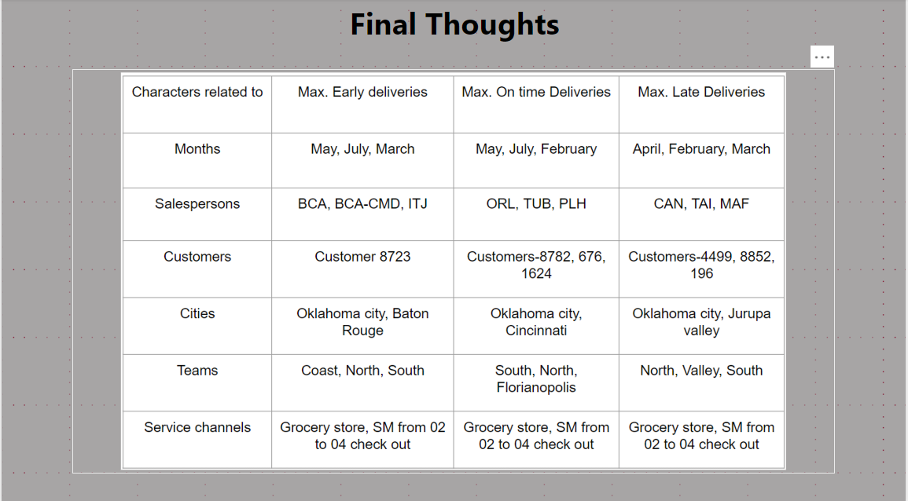
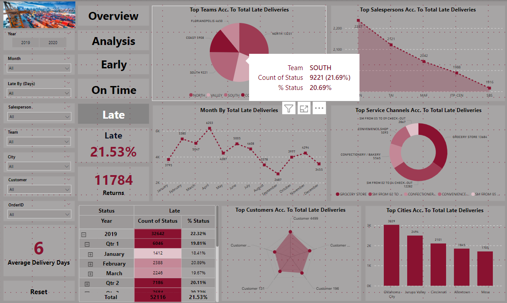
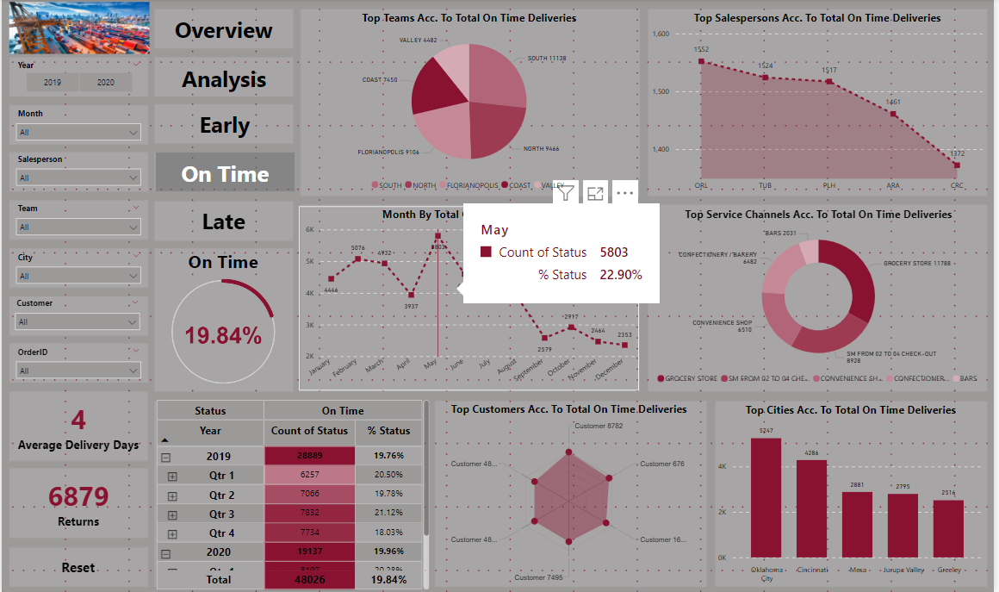
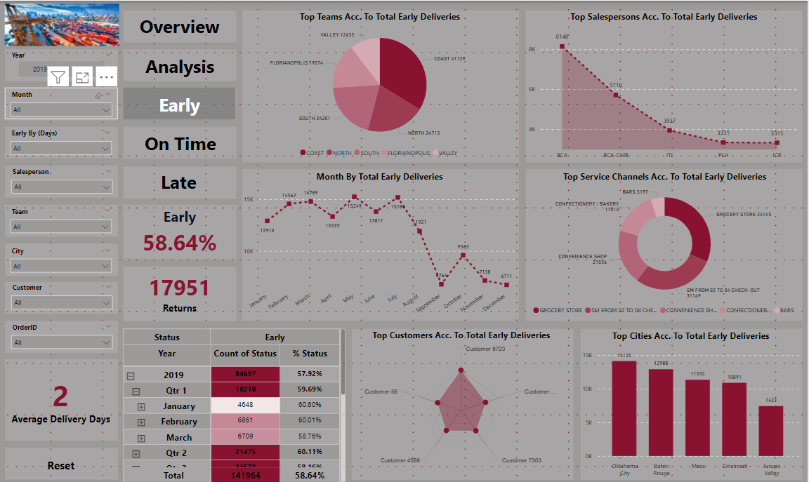
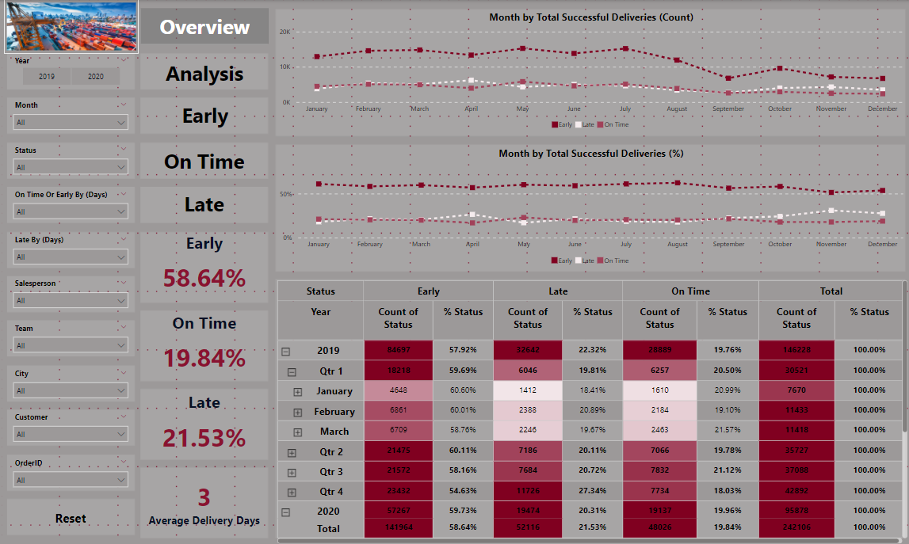
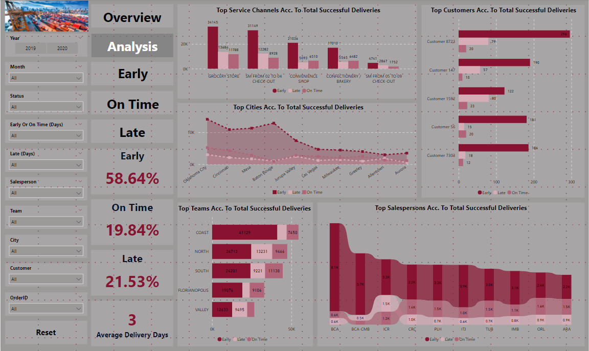

# Logistics Dashboard for OTIF Analysis

## Overview
This project involves the creation of an interactive Power BI dashboard for analyzing OTIF (**On-Time In-Full**) performance in the logistics and supply chain industry. The dashboard provides key insights into delivery trends, performance metrics, and highlights key influencers across various parameters like salespersons, teams, cities, and service channels.

## Key Features
- **Delivery Status Analysis**: Comprehensive breakdown of deliveries into **Early**, **On-Time**, and **Late** categories.
- **Advanced KPIs**: Interactive KPIs for performance tracking over time.
- **Key Influencer Insights**: Identification of top-performing salespersons, teams, cities, and service channels.
- **Custom Visualizations**: Advanced visual breakdowns for actionable insights.
- **Performance Trends**: Monthly and quarterly trends to identify patterns and improve operations.

## Data Sources
The project uses four datasets:
1. **Orders**: Details about the placed orders.
2. **Salesperson**: Information on sales representatives.
3. **Customer**: Data about customers placing orders.
4. **City**: Information about the cities where deliveries occurred.

## Key Insights
- **Early Deliveries**: Representing **58.64%** of all deliveries, with the highest occurrences in May, July, and March.
- **On-Time Deliveries**: Accounting for **19.84%**, peaking in May, July, and February.
- **Late Deliveries**: Making up **21.53%**, most common in April, February, and March.

## Dashboard Screenshots
### 1. Final Thoughts

### 2. Late Deliveries

### 3. On-Time Deliveries

### 4. Early Deliveries

### 5. Overview

### 6. Analysis

## Usage
1. **Interactive Filters**: Use the filters for year, month, salesperson, team, city, and customer to drill down into specific data.
2. **Insights by Status**: Explore delivery trends by status (Early, On-Time, Late) to identify patterns and opportunities for improvement.
3. **Comparative Analysis**: Compare performance across teams, service channels, and salespersons to enhance decision-making.

## Technologies Used
- **Power BI**: For creating the interactive dashboard.
- **Excel**: For data cleaning and preprocessing.

## Conclusion
This dashboard serves as a powerful tool for tracking and improving OTIF performance. It provides valuable insights to logistics stakeholders, enabling them to make data-driven decisions and optimize delivery operations.

---

### Suggestions and Feedback
Feel free to contribute to this repository by sharing suggestions or raising issues to improve the dashboard further.
